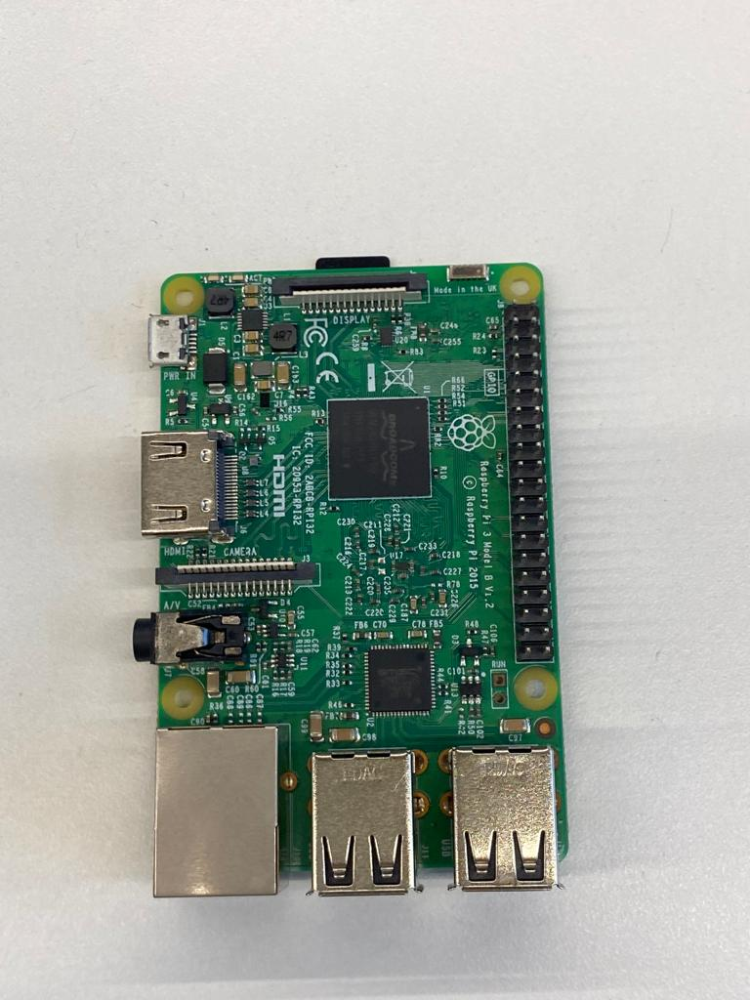
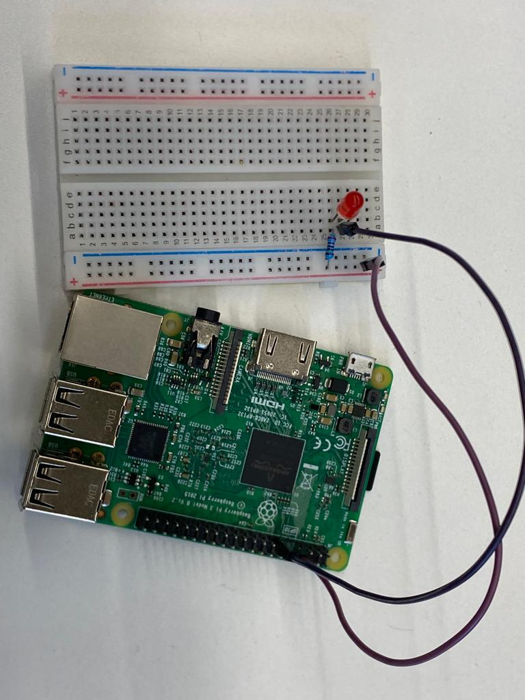
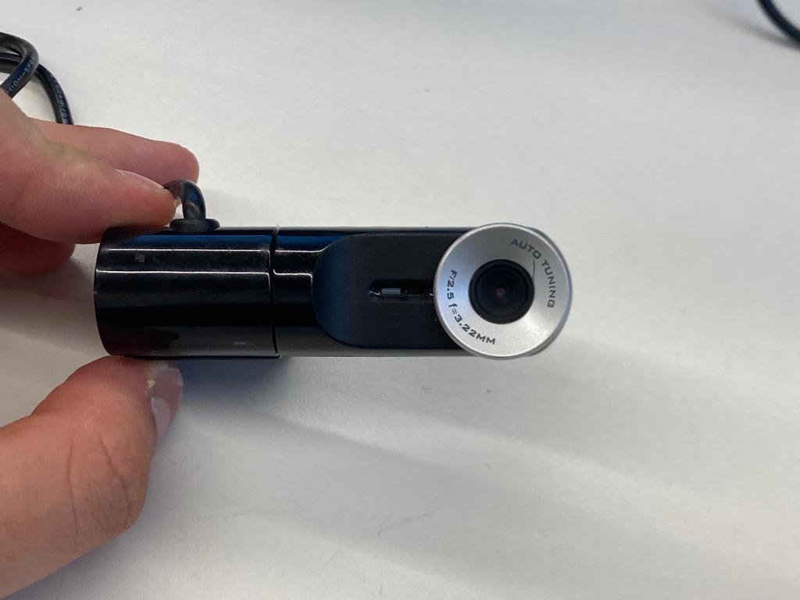
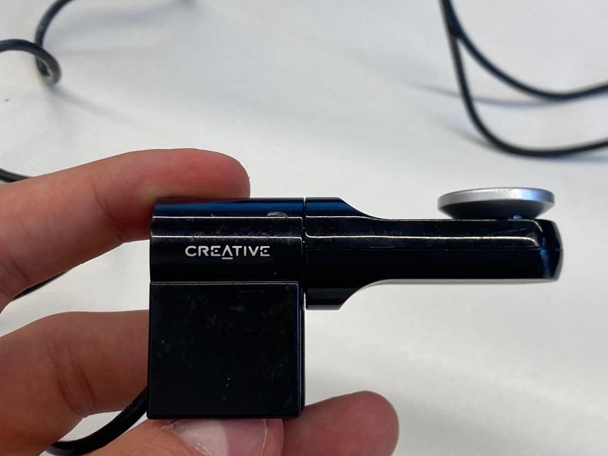

## 1. Introdução

Com o objetivo de utilizar o Raspberry Pi, foi desenvolvido um software capaz de detectar o rosto de pessoas e disparar um sinal digital em tempo real com baixo custo de processamento. Este repositório trata-se de um projeto realizado no Instituto Mauá de Tecnologia para a disciplina de Microcontroladores e Sistemas Embarcados. Foi utilizado uma Raspberry Pi 3 B, webcam 800x600 de resolução, protoboard e um led.

## 2. Dependências

Este projeto depende das seguintes bibliotecas:

- Python >= 3.5
- OpenCV-Python
- OpenCV-Contrib-Python
- NumPy
- SciPy
- Matplotlib

## 3. Como rodar

### 3.1 Instalar dependências

``` 
sudo apt install libopencv-dev
sudo apt install libatlas-base-dev
pip3 install Pillow numpy scipy matplotlib
pip3 install opencv-python opencv-contrib-python
```

### 3.2 Rodar o script

Rode o script que está na pasta ```/src```  com: ```python3 scr/$FOLDER_NAME$/$SCRIPT_NAME$.py```

## 4. Demostração do projeto

### 4.1 Fotos









### 4.2 Vídeo


!(Video demonstração)[https://youtu.be/zMmiK-DVZwM]

## 5. Integrantes

- Ubirantan da Motta Filho R.A 20.00928.3
- João Paulo M Socio R.A 20.00704-3
- Luan Teixeira R.A 20.01681-6
- Bruno Davidovitch Bertanha R.A 20.01521-6
